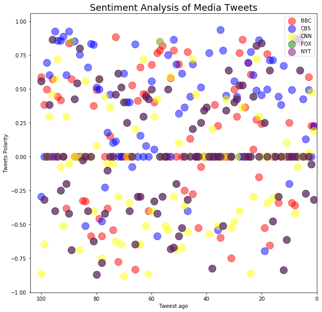
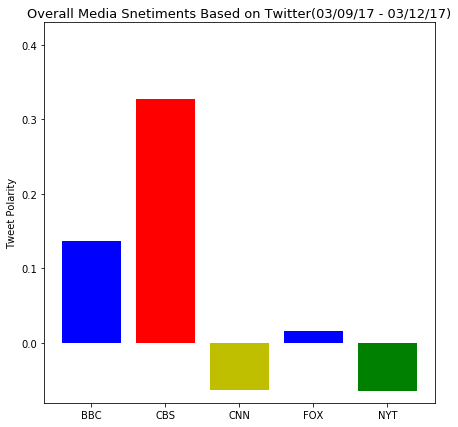

```python
import tweepy
import pandas as pd
import matplotlib.pyplot as plt
import time
import random
import numpy 
import json
import requests
import numpy as np
from pprint import pprint
from vaderSentiment.vaderSentiment import SentimentIntensityAnalyzer
analyzer = SentimentIntensityAnalyzer()
```


```python
from config import (consumer_key, 
                    consumer_secret, 
                    access_token, 
                    access_token_secret)

# Setup Tweepy API Authentication
auth = tweepy.OAuthHandler(consumer_key, consumer_secret)
auth.set_access_token(access_token, access_token_secret)
api = tweepy.API(auth, parser=tweepy.parsers.JSONParser())
```


```python
# BBC, CBS, CNN, Fox, and New York times.
target_user = ['@BBC', '@CBS', "@CNN", "@FoxNews", "@nytimes"]
filename = ["bbc_sentiment", "cbs_sentiment", "cnn_sentiment", "fox_sentiment", "nyt_sentiment"]
```


```python
def NewsOrg_sentiment(target):
    counter = 1
    sentiments = []
    public_tweet = api.user_timeline(target, count = 100 )
    
    for tweet in public_tweet :
        
        results = analyzer.polarity_scores(tweet["text"])
        compound = results["compound"]
        pos = results["pos"]
        neu = results["neu"]
        neg = results["neg"]
        tweets_ago = counter
        
        sentiments.append({
            "twitter source account" : target,
            "Tweets ago" : tweets_ago,
            "Date" : tweet['created_at'],
            "Compound" : compound,
            'Negative' : neg,
            "Positive"  : pos,
            "Neutral"  : neu,
            "tweet_text" : tweet["text"]
            
        })
        
        counter = counter + 1
        
    data= pd.DataFrame.from_dict(sentiments)
    data.sort_index(axis=0 ,ascending=False, inplace = True)  
    return  data
```


```python
bbc_sentiment = NewsOrg_sentiment('@BBC')
cbs_sentiment = NewsOrg_sentiment('@CBS')
cnn_sentiment = NewsOrg_sentiment("@CNN")
fox_sentiment = NewsOrg_sentiment("@FoxNews")
nyt_sentiment = NewsOrg_sentiment("@nytimes")
```


```python
# save each file into csv
# def savecsv(filename):
#     pd.to_csv()
```


```python
bbc_sentiment.head()
```


<div>
<style scoped>
    .dataframe tbody tr th:only-of-type {
        vertical-align: middle;
    }

    .dataframe tbody tr th {
        vertical-align: top;
    }

    .dataframe thead th {
        text-align: right;
    }
</style>
<table border="1" class="dataframe">
  <thead>
    <tr style="text-align: right;">
      <th></th>
      <th>Compound</th>
      <th>Date</th>
      <th>Negative</th>
      <th>Neutral</th>
      <th>Positive</th>
      <th>Tweets ago</th>
      <th>tweet_text</th>
      <th>twitter source account</th>
    </tr>
  </thead>
  <tbody>
    <tr>
      <th>99</th>
      <td>0.5848</td>
      <td>Fri Mar 09 16:56:13 +0000 2018</td>
      <td>0.0</td>
      <td>0.807</td>
      <td>0.193</td>
      <td>100</td>
      <td>RT @bbcwritersroom: "I felt like a real writer...</td>
      <td>@BBC</td>
    </tr>
    <tr>
      <th>98</th>
      <td>0.3818</td>
      <td>Fri Mar 09 16:56:32 +0000 2018</td>
      <td>0.0</td>
      <td>0.874</td>
      <td>0.126</td>
      <td>99</td>
      <td>RT @bbcworldservice: These images of women on ...</td>
      <td>@BBC</td>
    </tr>
    <tr>
      <th>97</th>
      <td>0.4939</td>
      <td>Fri Mar 09 17:00:10 +0000 2018</td>
      <td>0.0</td>
      <td>0.656</td>
      <td>0.344</td>
      <td>98</td>
      <td>Want to improve your persuasion powers? \n\n😻 ...</td>
      <td>@BBC</td>
    </tr>
    <tr>
      <th>96</th>
      <td>0.0000</td>
      <td>Fri Mar 09 17:18:55 +0000 2018</td>
      <td>0.0</td>
      <td>1.000</td>
      <td>0.000</td>
      <td>97</td>
      <td>RT @bbcthesocial: Instead of a plastic straw, ...</td>
      <td>@BBC</td>
    </tr>
    <tr>
      <th>95</th>
      <td>0.5719</td>
      <td>Fri Mar 09 18:00:10 +0000 2018</td>
      <td>0.0</td>
      <td>0.764</td>
      <td>0.236</td>
      <td>96</td>
      <td>💘 @MabelMcVey covering @Coldplay's 'Fix You' i...</td>
      <td>@BBC</td>
    </tr>
  </tbody>
</table>
</div>


```python
def plotting_scatter(x, y, color, label) :  
    return plt.scatter(x, y, c = color, alpha = 0.5,  s = 200,  label = label)
```


```python
plt.figure(figsize =(10,10))

plotting_scatter(bbc_sentiment['Tweets ago'], bbc_sentiment['Compound'], "r", 'BBC')
plotting_scatter(cbs_sentiment['Tweets ago'], cbs_sentiment['Compound'], "b", 'CBS')
plotting_scatter(cnn_sentiment['Tweets ago'], cnn_sentiment['Compound'], "yellow", 'CNN')
plotting_scatter(fox_sentiment['Tweets ago'], fox_sentiment['Compound'], "g", 'FOX')
plotting_scatter(fox_sentiment['Tweets ago'], fox_sentiment['Compound'], "purple", 'NYT')

plt.legend(loc = "upper right")
plt.title("Sentiment Analysis of Media Tweets" ,fontsize = 18)
plt.xlabel("Tweest ago")
plt.ylabel("Tweets Polarity")
plt.xlim(104,-0.04)
plt.show()
#plt.savefig("Sentimental Analysis of Media Tweets")
```





```python
x =  {
    "BBC" : np.mean(bbc_sentiment['Compound']), 
    "CBS" : np.mean(cbs_sentiment['Compound']),
    "CNN" : np.mean(cnn_sentiment['Compound']),
    "FOX": np.mean(fox_sentiment['Compound']),
    "NYT": np.mean(nyt_sentiment['Compound']) }
x
```


    {'BBC': 0.13696900000000004,
     'CBS': 0.327577,
     'CNN': -0.06344400000000001,
     'FOX': 0.016046000000000005,
     'NYT': -0.06412299999999999}


```python
plt.figure(figsize = (7,7))
plt.bar(x.keys(), x.values(), color = ['b', 'r', 'y', 'b', 'g'])
plt.title('Overall Media Snetiments Based on Twitter(03/09/17 - 03/12/17)', fontsize = 13)
plt.ylabel("Tweet Polarity")
plt.ylim(-0.08, 0.43)
plt.show()
#plt.savefig("Overall Twitter Sentiments")
```




